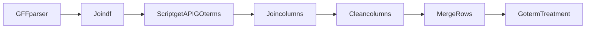
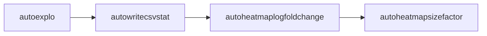
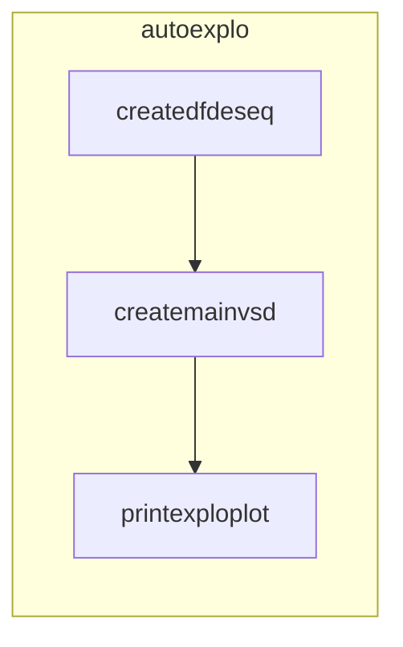
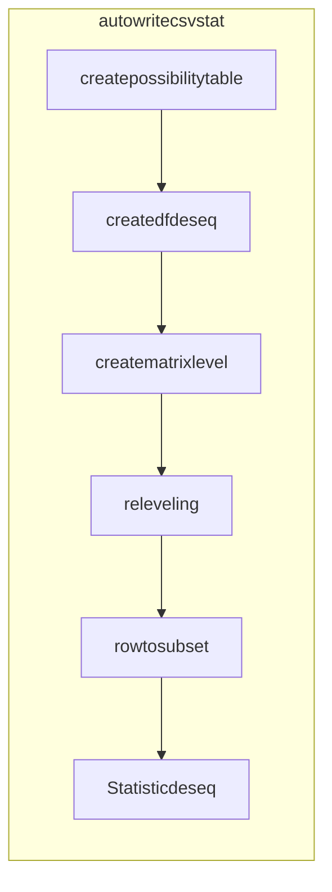
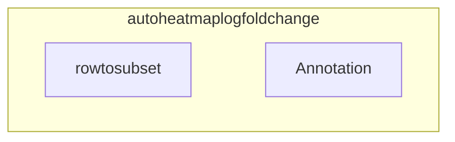
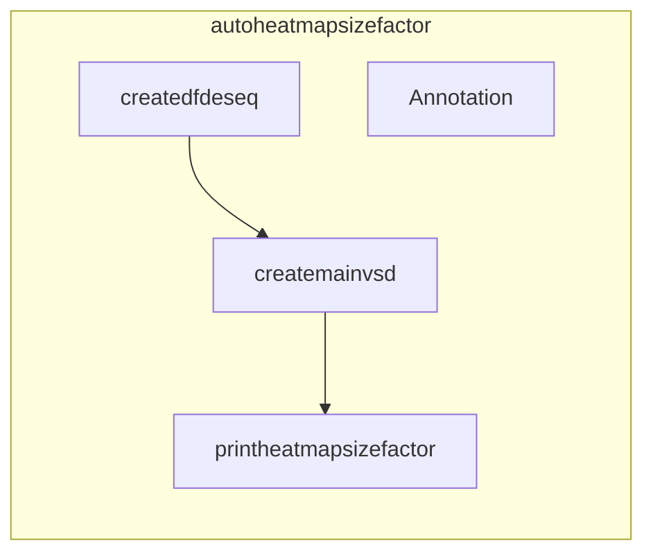

# Transcriptomic

This file contains every scripts used for the GFF annotation and the transcriptomic automation.

### Workflow of the creation of a GFF annotated with both GO-terms and their associated keywords

### Workflow of the transcriptomic analysis automation.

### Functions used by the autoexplo script, outputing a pdf providing information on the dataset using DESeq2.

### Functions used by the autowritecsvstat script, outputing numerous csv files, containing comparisons between each type of sample or conditions from the dataset.

### Function and data used by the autoheatmaplogfoldchange, outputing a JPEG containing an annotated heatmap corresponding to an inputted comparison CSV file.

### Functions and data used by the autoheatmapsizefactor, outputing a JPEG file containing an annotated heatmap corresponding to the counts analysis by DESeq2

