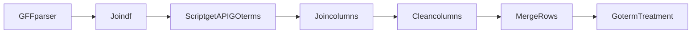
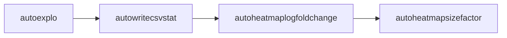
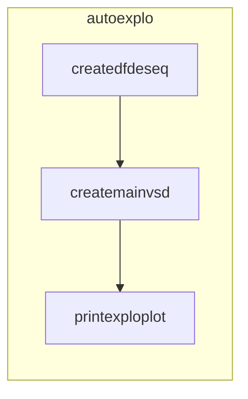
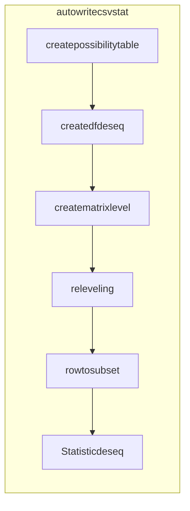
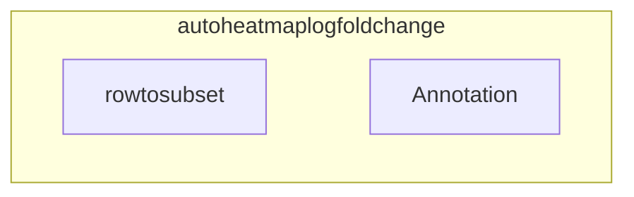
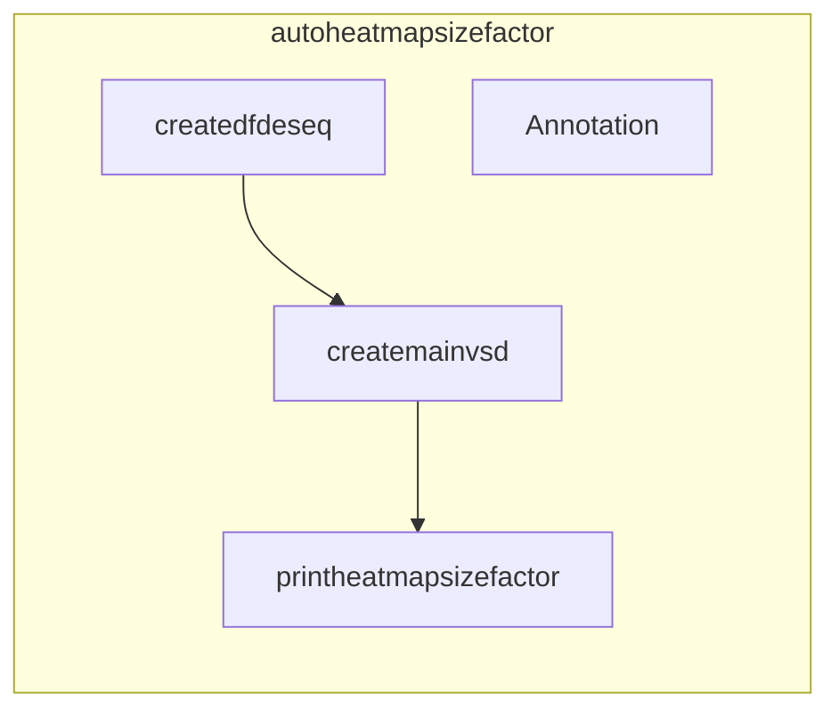

```mermaid
graph LR;
    GFFparser-->Joindf;
    Joindf-->ScriptgetAPIGOterms;
    ScriptgetAPIGOterms-->Joincolumns;
    Joincolumns-->Cleancolumns;
    Cleancolumns-->MergeRows;
    MergeRows-->GotermTreatment;
```

```mermaid
flowchart LR
autoexplo --> autowritecsvstat --> autoheatmaplogfoldchange -->autoheatmapsizefactor

```

```mermaid
flowchart LR
subgraph autoexplo
  direction TB
  createdfdeseq --> createmainvsd
  createmainvsd --> printexploplot
  
end
```

```mermaid
flowchart LR
subgraph autowritecsvstat
  direction TB
  createpossibilitytable --> createdfdeseq
  createdfdeseq --> creatematrixlevel
  creatematrixlevel --> releveling
  releveling --> rowtosubset
  rowtosubset --> Statisticdeseq
end
```

```mermaid
flowchart LR
subgraph autoheatmaplogfoldchange
  direction RL
  Annotation ~~~ rowtosubset
end
```

```mermaid
flowchart LR
subgraph autoheatmapsizefactor
  direction TB
  createdfdeseq --> createmainvsd
  Annotation ~~~ createmainvsd
  createmainvsd -->printheatmapsizefactor

end
```

